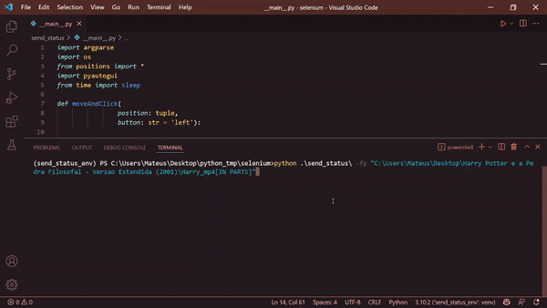

Script to send status in [Whatsapp Web](https://web.whatsapp.com/) using extension [WA Web Plus for WhatsApp](https://chrome.google.com/webstore/detail/wa-web-plus-for-whatsapp/ekcgkejcjdcmonfpmnljobemcbpnkamh?hl=pt-BR) in [Chrome](https://www.google.pt/intl/pt-PT/chrome/?brand=ISCS&gclid=EAIaIQobChMIqM7mpMeg9gIVi4SRCh24BAJjEAAYASAAEgIEWfD_BwE&gclsrc=aw.ds).
To use this script you should have installed [Python3](https://www.python.org/downloads/) and a lib called [pyautogui](https://pypi.org/project/PyAutoGUI/).

